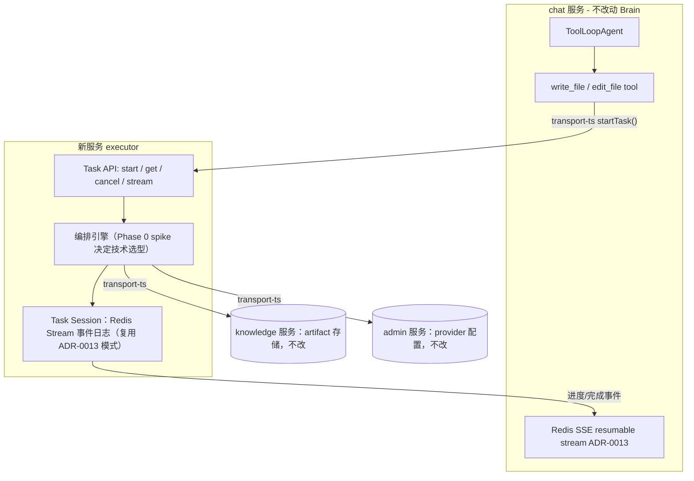

# Agent Task 执行时服务（tool-loop + workflow 组合）

> 状态：全部 Phase 已完成并验证。这是原始实施计划的完整记录（含 Phase 0 的排障过程），
> 面向决策的精简版本见 [ADR-0015](../ADR/0015-agent-task-executor.md)；后续对本计划本身的
> 批判性复盘见 [ADR-0016](../ADR/0016-post-implementation-review.md)。

## 概述

在 chat 服务旁新增一个独立的 executor 微服务，作为长任务的 durable Executor
（Brain = chat 的 `ToolLoopAgent` 不变，Hands + Session = 新服务），先承接现有
的 HTML artifact 生成，替换掉手搓的三层轮询，并把接口设计成可泛化到未来任意
大任务、可平滑接入 harness。

## 完成状态

- Phase 0-4 全部完成，包括两处未预见的 Nitro v3 beta 上游 bug（已修复并文档化）。
- 端到端验证：真实 provider 跑通 `html-artifact` task（2 页文档、19697 字符、
  0 失败块）；chat → executor 的 task 状态代理路由验证通过。
- 详见 [ADR-0015](../ADR/0015-agent-task-executor.md) 与
  `apps/backend/services/executor/AGENTS.md`。

## 背景与延续性

这不是新方向，是兑现本仓库自己 ADR 链条里明确留白的部分：

- [ADR-0011](../ADR/0011-tool-loop-agent-core.md)（当前生效）：主 agent 用
  `ToolLoopAgent`，明确写下 "A future background job must introduce
  Workflow/queue infrastructure at that job boundary, not wrap the core chat
  agent."
- [ADR-0012](../ADR/0012-agent-file-tools.md)（当前生效）：`write_file` 收敛
  成一个工具调用；consequences 明确承认 "Active process loss still cancels
  the run... remain for later product-level recovery work."
- 早期 [ADR-0005](../ADR/0005-chat-workflow-agent.md)/
  [0008](../ADR/0008-artifact-platform.md)/
  [0009](../ADR/0009-large-html-artifact.md) 尝试过把**整个主循环**换成
  `WorkflowAgent`（Nitro 托管），因为 `@backend/transport-ts` 是 source-only
  workspace 包，Nitro 编译期留下无法解析的裸 import，加上 pause/cancel/
  reconnect 语义和已有的 UIMessage SSE 协议冲突，被
  [ADR-0011](../ADR/0011-tool-loop-agent-core.md) 撤销。这次的关键区别：
  **只把 workflow 用在任务边界，不碰主循环**，Nitro 风险因此被限制在一个全新
  的、独立部署的服务里，且用 Phase 0 spike 提前验证。

## 目标架构

- **Brain**：`apps/backend/services/chat` 的 `ToolLoopAgent`，完全不动
  （`tool-loop.ts`、`run.ts`、`streams/service.ts` 均保持现状）。
- **Hands + Session**：新服务 `apps/backend/services/executor`，独立数据库/
  队列，独立部署单元，遵循根 `AGENTS.md` 的微服务边界规则（chat 通过
  `@backend/transport-ts` 调用它，不直接互相 import）。
- **外部工具契约不变**：延续 ADR-0012 的判断——一个 `write_file` 调用生成
  整篇文档，不按页拆 ToolLoop step。

## Phase 0 — 风险探测（已完成）

1. **P0 前端 bug 已修复**：`artifact.tsx` 的 HTML 预览 iframe 改成
   `sandbox="allow-scripts"`（不加 `allow-same-origin`），客户端 CSP 改为只在
   内容缺少后端 `data-chat-artifact-runtime` 标记时才注入（避免和后端自带的
   图表水合脚本 CSP 冲突）。`pnpm -F components typecheck` 通过。

2. **Nitro + `@backend/transport-ts` spike 已跑通，结论明确**：
   - 在 `apps/backend/services/executor` 搭了最小 Nitro + `workflow/nitro` +
     Hono 骨架，`workflows/spike.ts` 里一个 `"use step"` 函数真实 `import` 了
     `@backend/transport-ts`（`createInternalOpenApiClient`/`TransportError`）。
   - `nitro build` 的 workflow 编译阶段——"Discovering workflow directives" →
     "Created intermediate workflow bundle" → "Created steps bundle" →
     "Created manifest with 4 steps, 1 workflow"——**全部成功**。ADR-0011
     当年撞到的"source-only workspace 包裸 import 无法解析"的问题**没有重现**：
     esbuild/rolldown 的 workflow bundling 和 tsc emit 不是一回事，它能正确
     内联 `.ts` 源码。
   - 但在这之后，Nitro 自己的**生产服务器打包**阶段（`builder: rolldown`,
     `preset: node-server`）失败，报错来自 Nitro 内部依赖 `nf3`/
     `@vercel/nft` 的 ESM/CJS 互操作 bug（`Named export 'nodeFileTrace' not
     found`），与 `@backend/transport-ts` 或 workspace 结构完全无关。换了两个
     不同的 `nitro` beta 版本（`3.0.260522-beta`、`3.0.260610-beta`）都复现
     同一个错误；`nitro@3.0.0`（非 beta）是被 deprecate 的旧 API 形态，不兼容
     `workflow/nitro` 模块。`nitro dev` 在当前 sandbox 环境下另外撞到
     `EMFILE: too many open files`（文件监听数限制，是本沙箱环境的资源限制，
     不是 nitro/workflow 本身的问题）。
   - **结论**：我们真正担心的风险（source-only workspace 包能否被编译进
     durable step）已被证明不成立；剩下的是 **Nitro v3 目前处于 beta channel
     的一个上游打包 bug**，会阻塞 `nitro build` 产出生产可运行的 server
     bundle。

3. **Nitro 生产打包 bug 已修复**：报错定位到 `nf3`（Nitro 内部依赖）的
   `dist/_chunks/trace.mjs` 里一行 `import { nodeFileTrace } from
   "@vercel/nft"` 的 ESM 命名导入写法，在 rolldown 静态分析下失效。用
   `pnpm patch nf3@0.3.18` 改成 `import pkg from "@vercel/nft"; const {
   nodeFileTrace } = pkg;`，`pnpm patch-commit` 后写入了
   `apps/backend/patches/nf3@0.3.18.patch` + `pnpm-workspace.yaml` 的
   `patchedDependencies`。修完后完整验证通过：
   - `nitro build` 完整跑通，产出 `.output/server/index.mjs`。
   - 跑起来的服务器 `POST /spike` 真实调用 `start(spikeWorkflow, ...)`，拿到
     `runId`。
   - `npx workflow inspect run <runId> --json` 确认 workflow 状态
     `"completed"`，`output` 里 `{"hasClient":true,"errorClassName":
     "TransportError","userId":"spike-user"}` —— 证明 `"use step"` 函数里对
     `@backend/transport-ts`（`createInternalOpenApiClient`/`TransportError`）
     的调用不仅编译期解析成功，运行期也真实执行成功。

**结论：Nitro + Workflow DevKit 这条路线在这个仓库里完全可行，风险已清除。**
Phase 1 直接用真正的 Workflow DevKit（`workflow` + `@ai-sdk/workflow`），不需
要退到自建 runtime。

## Phase 1 — 服务骨架 + Task API（已完成）

- `apps/backend/services/executor` 搭建完毕：Hono + Nitro + Workflow DevKit，
  MySQL（Drizzle，`tasks` 表）存业务真相，Workflow World 存执行真相（本地默认
  Local World，部署环境用新增的 `workflow-postgres` docker 服务 +
  `@workflow/world-postgres`）。
- Task API 已实现并端到端验证通过：`POST /tasks`（幂等，按
  `owner_service`+`owner_ref`）→ 立即返回 `queued`/`running`；`GET /tasks/:id`
  轮询状态；`POST /tasks/:id/cancel`。`reconcilePendingTasks()` 在启动时重新
  挂载未完成任务的完成监听，进程重启不丢结果。
  （`GET /tasks/:id/stream` 曾作为占位端点存在，后续批判性复盘中因为从未有
  真实调用方而被删除，见 ADR-0016。）
- `TaskType` registry（`src/tasks/registry.ts`）已就位，`echo` 类型跑通全链路
  （create → workflow 执行 → 状态变为 completed → 结果落库），验证了 Zod
  校验、鉴权、错误路径、幂等重试。
- `@backend/transport-ts` 新增 `ExecutorInternalClient`，OpenAPI 规范已生成到
  `schemas/openapi/executor-server.json`。
- `justfile`（NODE_SERVICES/PORTS）、`Procfile.dev`、`docker-compose.yml`、
  `scripts/install-deps.sh`、`pnpm-workspace.yaml`、`AGENTS.md`、
  `Dockerfile`、迁移 `v1.0.0.sql` 均已就位。
  （`workflow-postgres` 最初加进了本地共享的 `docker-compose.yml`，一轮复盘
  中曾移出、改成本地默认用文件系统 Local World，理由是"本地代码路径用不上"
  ——但这个理由后来被推翻：本地/生产一致是更该优先的原则，而且这次简化
  差点让一个真实 bug（executor 从没调用 `getWorld().start()`，Postgres
  World 的队列在生产环境里永远不会真正处理 step）长期不被发现，因为本地
  测试从没走过那条代码路径。最终 `workflow-postgres` 又加回了本地
  `docker-compose.yml`，`just up` 里加了 schema 初始化步骤，Local World
  只作为手动降级选项保留。）
- 顺手清理了 chat `.env.example` 里已经失效的 `WORKFLOW_POSTGRES_URL` 残留
  （chat 不再用 workflow，这个变量现在属于 executor）。

## Phase 2 — 迁移 HTML artifact 生成（已完成）

- 把 `worker.ts`、`generation-runner.ts` 里的编排逻辑（plan → 并发 block 生成
  → compile → publish）搬进 `executor` 服务，实现为该服务的一个
  `TaskType`；`generator.ts`/`compiler.ts`/`template.ts` 中与 LLM/HTML 无关
  的纯逻辑原样迁移或共享。
- chat 侧 `builtins/artifacts.ts` 的 `write_file`/`edit_file` 改为调用
  `executor` 的 Task API，不再自己跑 worker pool / 三层轮询。
- `write_file` 立即返回 `{status, task_id}`，不阻塞当前 turn。
  **原计划设想用 `data-artifact-progress` data part（ID reconciliation 增量
  更新）合并进主聊天 UIMessage 流**——实际交付时只做了前端对
  `GET /:conversationId/tasks/:taskId` 的轮询（`ArtifactTaskCard`），没有真正
  实现 data part 机制。这个缺口在两轮复盘之后才被发现并补上，完整过程见
  [executor-task-progress-notifications.md](./executor-task-progress-notifications.md)。
- 删除了旧的 `ArtifactJobBar.tsx`（1.5s REST 轮询）和 `ChatArtifactCard.tsx`
  里已确认零引用的死代码（`parseArtifactStreamData`/`StreamingArtifactCard`）。
- `knowledge` 服务的 artifact 存储 API（`reserveArtifactGeneration`/
  `saveArtifactBlock`/`publishArtifactRevision` 等）保持不变，继续被新服务
  调用；`claim`/`renew`/`phase`/`claimable`/`unfinished` 等属于旧 worker 池
  协调协议的端点，在后续复盘中确认无调用方后删除（见 ADR-0016）。

## Phase 3 — 泛化 Task 抽象 + Harness 预留（已完成）

- Task API 和 `TaskType` registry 保持领域无关，为后续"多文件代码生成"
  "深度研究""批处理"等能力预留同一条基础设施，不再让每个能力各自发明一套
  lease/worker/poll。
- 在 `executor` 服务内为"执行引擎"定义了一个内部接口（当前实现是 LLM 调用 +
  HTML 编译），为未来接入 harness（Codex/Claude Code/Pi 风格外部 session）
  换一个执行引擎实现留好缝，chat 侧工具契约和前端流协议不需要因此改变。

## Phase 4 — 文档与收尾（已完成）

- 新增 [ADR-0015](../ADR/0015-agent-task-executor.md) 记录本次决策，标注它
  延续/落实 ADR-0011、0012 的留白。
- 修正了 chat `AGENTS.md` 中与实际工具名不符的描述。
- 清理了根 `AGENTS.md`/README/`.env.example` 里已经停用但仍被提及的
  "Workflow Postgres" 残留提法，改为准确反映 `executor` 服务自己的数据库。

## 已确认的决策

1. **服务命名**：`executor`。
2. **非阻塞方向**：`write_file` 立即返回 + 后台完成后卡片自然出现（对齐
   Cursor/Codex 体验）。

## 已知遗留

- Phase 2 提到的"进度 data part"当时没有真正落地，只做了状态轮询——后续修复
  见 [executor-task-progress-notifications.md](./executor-task-progress-notifications.md)。
- 一次系统性批判性复盘发现的其余问题（部署配置缺口、重复的 SSRF 防护代码、
  `knowledge` 里的死代码、`just lint` 被新服务破坏等）已在
  [ADR-0016](../ADR/0016-post-implementation-review.md) 中记录并修复。
