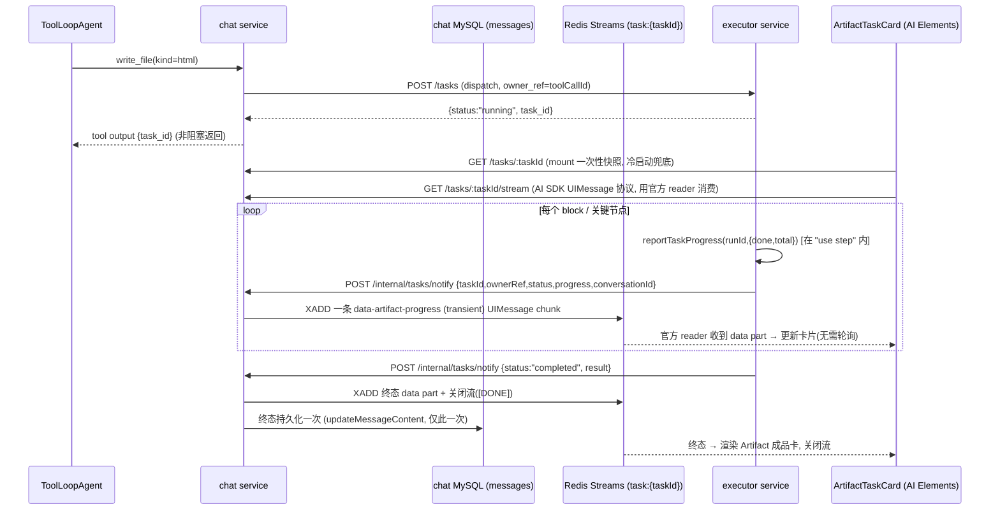

# Executor 任务进度主动推送（官方原生方案）

> 状态：**已实施（Phase 1）**。轮询已删除，改为 executor → chat → 浏览器的
> 原生 UIMessage SSE 推送。承接
> [agent-task-executor-service.md](./agent-task-executor-service.md) Phase 2
> 里没有落地的"进度 data part"。
>
> ## 实施结果与对草案的两处收敛（务必先读）
>
> 落地时相对下文草案做了两处简化，最终以此为准：
>
> 1. **前端彻底改为「纯流」，不再保留任何一次性 `fetchConversationTask`。**
>    草案曾建议 mount 时先拉一次快照兜底。实测没必要：`GET
>    /:conversationId/tasks/:taskId/stream` 在连接建立瞬间就由 chat 从 executor
>    读取当前快照作为首帧（`taskSeedFrames`），终态任务直接首帧给终态并立即
>    `[DONE]` 关流。因此卡片只开一条流即可覆盖「实时 / 刷新后 / 完成很久后」三
>    种情况，`ChatArtifactCard` 里再无任何定时器。
> 2. **不把进度 data part 回写进聊天历史消息。** 草案里的
>    `findMessageByToolCallId` + upsert 被放弃：**executor 的 `tasks` 表就是持久
>    真相**，刷新后由流首帧重新 seed，历史消息保持「工具 part 带 task_id」不变，
>    避免与 `run.ts` 的消息持久化竞争、也少一处解析/再序列化。
>
> 其余（executor 加 `progress` 列并按 block 上报、chat 复用 Redis Streams 传输
> 泛化出 task-scoped 流、前端用 `parseJsonEventStream` + `readUIMessageStream`
> 官方原语消费）均按下文实施。中间进度帧走 task 专属流（非聊天历史流），因此无需
> transient 标记——该流本身就是临时的、不落历史。
>
> 本版是对早期草案的一次架构修正：早期草案打算自造一条 Redis pub/sub + 独立
> `GET /:conversationId/tasks/events` SSE 端点 + 前端手写切帧解析器。经复核，
> 这会给仓库引入**第三套平行流式栈**，且直接违反 chat MFE 自己的规则
> （`apps/frontend/apps/chat/AGENTS.md`：*"Chat uses AI SDK `useChat` + native
> UIMessage parts. Reconnection replays that same protocol; **do not add a
> parallel one**."*）。因此改为**跟随 Vercel AI SDK 官方原语**：进度以原生
> `data-*` UIMessage part 表达，复用现有 resumable-stream 传输，前端用 AI SDK
> 自带的流读取 + AI Elements 组件渲染，不自造轮子。
>
> ## 后续决策：artifact 工具改为「前台阻塞」（本推送流仅作 UX 通道）
>
> 本方案落地后发现一个更上层的编排问题：`write_file`/`edit_file` 的 HTML 分支
> 原本**非阻塞**（派发即返回 `task_id`），导致主 agent 拿不到产物就按计划发起
> 下一次 `edit_file`，对同一文档派发**互相竞争的任务**。修复见 **ADR-0015
> Revision**：HTML 工具改为 **async generator**，先 `yield` `{task_id}`（卡片
> 立即挂载并订阅本方案的进度流），再**阻塞等待** executor 任务终态（以
> `GET /tasks/:id` 快照为准），最后 `yield` `{document_id}`。
>
> 关键分工：**本推送流（executor→notify→task-scoped Redis 流→卡片）只负责顺滑
> 的中间进度（UX）**；工具「何时返回」由 `GET /tasks/:id` 轮询这一**权威信号**
> 决定——best-effort 的 notify 丢一帧绝不能挂死一个阻塞工具。因此本方案的推送
> 链路全部保留、语义不变，只是不再承担「完成判定」。阻塞期间会话并不静默：AI
> SDK v7 会把 generator 的每次 `yield` 作为 preliminary 工具输出实时下发（且中间
> 值不进模型上下文），配合本进度流，用户全程看到「已生成 N/总数 页」。

## 概述

把 executor 任务的进度/完成通知从"前端从任务一开始就每 2 秒无脑轮询"改成
"executor 主动上报 → chat 以 **AI SDK 原生 `data-artifact-progress` UIMessage
part** 的形状经**已有的 resumable-stream 通道**转发 → 前端用 AI SDK 自带的流
读取消费、AI Elements 渲染"，同时给 executor 的 Task 补上真正的进度概念
（目前只有 queued/running/终态的二元状态，没有任何中间进度字段）。

核心原则：**能用官方原语就不自造**。中间进度用官方的 **transient data part**
（不落历史、不写放大），只有**终态**持久化一次进消息（刷新可见）。

## 问题诊断

调研确认了三个事实（均已核实，非猜测）：

1. **`ArtifactTaskCard` 从挂载瞬间就开始轮询**：
   `apps/frontend/apps/chat/src/components/ChatArtifactCard.tsx` 里
   `POLL_MS = 2_000`，`useEffect` 里直接 `void poll()`，没有任何延迟——工具
   调用刚返回 `task_id`、卡片一渲染就立刻打第一枪，且此后固定每 2 秒打一次，
   直到终态。这正是"任务才刚开始跑就急着查询"的来源。
2. **executor 的 Task 模型没有"进度"这个概念**：
   `apps/backend/services/executor/src/infrastructure/persistence/schema.ts` 的 `tasks` 表和
   `src/application/tasks/types.ts` 的 `TaskSnapshot` 只有 `status`
   （`queued|running|completed|failed|cancelled`），没有 `progress` 字段。
   `workflows/html-artifact.ts` 的 `generateBlockStep` 每完成一个 block 只会
   写回 knowledge，从不上报"第几块做完了"。所以即使换成推送，今天也没有
   "关键进展"可推——必须先补上进度概念。
3. **executor → chat 没有任何反向通道**：现有调用方向全是 chat → executor
   （HTTP，轮询）。Workflow DevKit 的 `hook`/`createHook` 机制是"暂停等待
   外部输入"（human-in-the-loop），不是"我主动通知你"；官方也没有"完成时
   自动 webhook"配置项。唯一可行路径是在 `"use step"` 函数里手写一次出站
   HTTP 调用（`"use step"` 是完整 Node 运行时，普通 `fetch`/现有
   transport-ts 客户端模式都能用）。

## 官方实践调研（先查后做，根 AGENTS.md 硬性要求）

调研 Vercel AI SDK v7 官方文档与生态（2026-07 复核），结论是**官方原语能覆盖
本场景的绝大部分，应当直接采纳**，只有"跨进程、且 stream 已关闭之后再推"这
一段需要落到我们已有的传输设施上：

1. **原生 data part + 按 `id` reconcile**
   （[Streaming Custom Data](https://ai-sdk.dev/v7/docs/ai-sdk-ui/streaming-data)）：
   `writer.write({type:"data-artifact-progress", id: taskId, data:{...}})`，同
   `id` 再写一次客户端自动替换而非追加。这就是最初 Phase 2 todo 里"进度 data
   part"字面指向的机制——仓库至今没用过它，不是它不存在。
2. **transient data part**（`transient: true`，
   [官方 feat #6987](https://github.com/vercel/ai/commit/97c35c0ef0a65c61cba8d48beb5f9ac5b2eaddd3)）：
   标记为 transient 的 part 会推给客户端、经 `useChat` 的 `onData` 消费，但
   **不写入 `message.parts`、不进历史**。这正是"高频进度 tick 不该污染持久化
   历史"的官方答案。→ **中间进度用 transient，终态才持久化。**
3. **resumable stream 是官方处理"断线/后台续传"的标准原语**
   （[`ai-resumable-stream`](https://registry.npmjs.org/ai-resumable-stream) +
   [Chatbot Resume Streams](https://ai-sdk.dev/docs/ai-sdk-ui/chatbot-resume-streams)）。
   官方明确指出：客户端断开只是关掉 HTTP 连接，**不等于取消后台工作**，后台
   job/workflow/stream writer 可以继续，客户端重连回同一条流——**这正是我们
   "任务不阻塞、卡片可重连"的心智模型**。本仓库已经有一套等价实现（ADR-0013，
   `agent/streams/service.ts` 的 Redis Streams `XADD`/`XREAD`），Phase 1 复用
   它，Phase 2 再整体迁到官方包（见文末）。
4. **AI Elements 已提供现成组件**：`Task`（可折叠、pending/in-progress/
   completed/error 状态图标、内置 done/total 进度计数）与 `Artifact`（带 header
   actions 的成品容器）。且本仓库的 `components/ai-chat` 入口
   （`packages/components/src/AiChat/index.tsx`）**已经封装并导出**了
   `Task`/`TaskTitle`/`TaskDescription`（`./workflow`）和 `Artifact` 全家桶
   （含 `ArtifactPreview`）——直接用，不用新装。
5. **不采用 `untilIdle`/保持 model run 常开**：这是官方生态里另一条路径，会把
   ADR-0011 放弃"Workflow 驱动主循环"的理由（第二套流协议、模糊 pause/cancel、
   重连循环）请回来。见下节"关键设计判断"对这一点的澄清。

## 关键设计判断

1. **"复用 resumable 传输" ≠ "untilIdle" ≠ "违反 ADR-0011"**。ADR-0011 否掉的
   是让 **model / 主 agent 循环** 常驻在 Workflow 里。而 resumable stream 只是
   一条**传输通道**：本场景的生产者是 **executor**，不是模型；chat 不需要为此
   让任何 model run 保持存活。复用官方/原生的流式传输，不会把 ADR-0011 杀掉的
   东西带回来。早期草案把两者混为一谈、据此否定官方路径，是本次修正的关键。
2. **中间进度 transient、终态持久化一次**。早期草案每完成一个 block 就
   `updateMessageContent` 落库，并自认有写放大与并发覆盖竞态。改用官方 transient
   语义后：中间 tick 只实时推、不落库（历史零膨胀）；只有终态写一次消息。
   → 早期草案"范围之外"里那条"upsert 并发覆盖"的隐患随之消失，`upsertDataPart`
   从"每 tick 调用"降为"终态调一次"。
3. **传输层用我们已有的 Redis Streams 追加模型，而不是官方包的 drain-loop
   生产者**。官方 `ai-resumable-stream` 的生产者是"给一个 `ReadableStream`
   源、由它 drain 到 Redis"，适合"同一进程内有一条活的源流"。但我们的生产者
   是**跨进程、稀疏、分钟级**的事件（executor 每完成一块发一次 HTTP notify），
   每次 notify 是独立请求，没有一条常驻源流。我们现有的 `XADD`（每次 notify
   独立追加、无需常驻 controller、进程重启也能继续追加）**天生更贴合这种跨进程
   稀疏事件**。所以 Phase 1：**协议形状 / 客户端读取 / transient 语义 / AI
   Elements 全部跟官方，唯独传输的"写入模型"保留我们的 Streams 追加**。Phase 2
   再评估把两者统一到官方包。
4. **用 Streams 而非 pub/sub**：晚挂载/刷新后重连的卡片需要"重放到最新进度"，
   pub/sub 对晚订阅者直接丢消息（早期草案因此才必须保留 mount 时的补快照）；
   Redis Streams（带短 TTL）天然让晚挂载者拿到最新 tick，与 ADR-0013 现有机制
   一致，少一套基础设施。

## 目标架构

## 具体改动

### A. executor：进度模型 + 上报 + 出站通知

1. **迁移** `apps/backend/services/executor/migrations/versions/v1.1.0.sql`：
   给 `tasks` 表加 `progress JSON NULL`。同步
   `apps/backend/services/executor/src/infrastructure/persistence/schema.ts` 加
   `progress: json("progress").$type<{done:number; total:number} | null>()`。
2. `src/application/tasks/types.ts`：`TaskSnapshot` 加
   `progress: { done: number; total: number } | null`。
3. `src/config.ts`：加 `chatServiceUrl`（新 env `CHAT_SERVICE_URL`，默认
   `http://localhost:8009`），`.env.example` 同步。
4. `src/application/tasks/service.ts` 新增：
   - `reportTaskProgress(workflowRunId, {done,total})`：按 workflow_run_id
     找到 task 行，更新 `progress` 列，然后调用 `notifyOwner`。
   - `notifyOwner(row)`（内部函数，`watchCompletion` 的成功/失败/取消分支和
     `reportTaskProgress` 都调用它）：若 `row.ownerService === "chat"`，从
     `row.payload`（duck-typing，只要有 `conversationId: string` 就转发）取
     `conversationId`，POST 到 `chatServiceUrl + "/internal/tasks/notify"`，
     body 为 `{taskId, ownerRef, type, status, progress, result, error,
     conversationId}`；整个调用 `.catch(() => undefined)`，**绝不让通知失败
     影响任务本身状态**。
   - `watchCompletion` 的 `.then`/`.catch` 分支在更新 DB 后各加一行
     `notifyOwner(...)`。
5. `src/infrastructure/clients/chat.ts`（新文件，参照 `src/infrastructure/clients/knowledge.ts`）：包一层
   `ChatInternalClient`（新增在 `libs/transport-ts/src/chat.ts`，参照
   `libs/transport-ts/src/executor.ts`），暴露 `notifyTaskEvent(...)`。裸写
   `fetch` 也可，倾向复用 transport-ts 以保持跨服务调用的错误分类/超时一致。
6. `workflows/html-artifact.ts`：
   - `htmlArtifactWorkflow` 用 `getWorkflowMetadata()`（从 `"workflow"` 导入）
     取一次 `workflowRunId`，往下传给各 step。
   - `reserveStep` 返回后（已知 `plan.blocks.length` 总数）调一次
     `reportTaskProgress(runId,{done:0,total:plan.blocks.length})`。
   - `generateBlockStep` 完成后（在 `mapConcurrent` 的 worker 回调里，用一个
     已完成计数器）调 `reportTaskProgress(runId,{done,total})`——允许并发下
     的近似计数，这是"缓解焦虑的进度提示"，不是强一致计数器。
   - **重放安全性**：`reportTaskProgress` 的 HTTP 副作用必须在 `"use step"`
     函数体内触发（step 结果被 Workflow memoize，重放不会重跑 body）；**切勿**
     放到 workflow 编排体里（那会在每次重放时重复触发通知）。

### B. chat：接收通知 + 原生 data part 转发（复用 resumable 传输）+ 终态持久化

7. 新增入站内部鉴权中间件（参照 admin/knowledge/executor 的
   `internalAuthMiddleware`）应用到新的 `/internal/*` 路由组——chat 目前没有
   任何入站 `/internal/*` 路由，这是第一个。
8. **传输：泛化现有 resumable stream 支持 task-scoped 流。**
   `apps/backend/services/chat/src/application/agent/streams/service.ts` 目前按 `runId`
   建流（`chat:agent-streams:{runId}:sse`）。新增一组并列函数（或参数化 key）
   支持 `chat:task-streams:{taskId}`：`appendTaskChunk(taskId, chunk)`、
   `replayTaskStream(taskId)`（复用 `XREAD BLOCK` + duplicate 连接的既有做法）、
   `closeTaskStream(taskId)`。**写入的内容是 AI SDK 数据流协议的 SSE chunk**
   （和主 run 完全同一协议、同 `UI_MESSAGE_STREAM_HEADERS`），不是自定义帧。
9. `POST /internal/tasks/notify`：解析 body，构造一条
   `data-artifact-progress` UIMessage chunk：
   - 中间态：`{type:"data-artifact-progress", id: taskId, transient: true,
     data:{status, progress}}` → `appendTaskChunk`（不落库）。
   - 终态：`{type:"data-artifact-progress", id: taskId,
     data:{status, progress, result, error}}`（**不带 transient**）→
     `appendTaskChunk` + `closeTaskStream`（写 `[DONE]`）+ **持久化一次**：
     用 `findMessageByToolCallId(conversationId, ownerRef)` 定位那条持有
     `tool-write_file`/`tool-edit_file` output 的助手消息，把终态 data part
     upsert 进其 `parts`（按 `id` 去重）后 `updateMessageContent` 落库。
     持久化失败只记日志、尽力而为，不回传错误给 executor（避免重试风暴）。
   - 生成 chunk 的推荐做法：用官方 `createUIMessageStream({execute})` 写一个
     part 再序列化为 SSE，或直接按数据流协议拼一行；实现时以 AI SDK 导出的
     序列化工具为准，**不手写私有格式**。
10. `apps/backend/services/chat/src/application/conversations.ts` 新增
    `findMessageByToolCallId(conversationId, toolCallId)`：扫描该会话消息，
    反序列化 `content`，匹配某个 tool part 的 `toolCallId`。仅终态调用（低频）。
11. `GET /:conversationId/tasks/:taskId/stream`（`agents.ts`，鉴权同其它
    `/:conversationId/...` 路由）：建立 SSE 响应，返回 `UI_MESSAGE_STREAM_HEADERS`，
    把 `replayTaskStream(taskId)` 的 chunk 逐帧 `enqueue`（**完全复用现有
    `GET /:conversationId/agents/run/stream` 的写法**，只是换数据源）。客户端
    断开即清理。→ 与主 run 流同协议、同消费方式，符合 chat MFE "不加平行协议"。

### C. 前端：官方 reader + AI Elements，取代轮询

12. `ChatArtifactCard.tsx` 的 `ArtifactTaskCard` 重写为"流驱动 + 快照兜底"：
    - **mount 时仍调一次** `fetchConversationTask` 拿当前快照，作为初始态和
      "刷新后 transient 已丢失"的兜底真相源（保留，不删）。
    - 非终态时，连 `GET /:conversationId/tasks/:taskId/stream`，用 **AI SDK
      自带的 UIMessage 流读取**（`readUIMessageStream` 或等价 client 工具，
      实现时按官方 API 确认）消费 `data-artifact-progress` part，**不手写
      `\n\n` 切帧解析器**（这正是早期草案要引入、被本版否掉的东西）。收到
      part 就 `setState`。
    - 删除 `POLL_MS` 的 `setTimeout` 轮询循环。仅当流"多次重连失败"时，才降级
      到一个远慢的轮询（如 15s）作为安全网，而非默认路径。
    - 终态收到即关闭流；渲染时 `done/total` 取单调最大值、`status` 终态优先
      （防迟到的 running 覆盖 completed）。
13. **渲染用 AI Elements（已封装在 `components/ai-chat`）**：
    - 进行中 → `Task`/`TaskTitle`/`TaskDescription`（内置 done/total 进度计数
      正好对应 `progress`）。
    - 完成 → 现有 `Artifact` 成品卡（保持）。
    - 卡片状态**由数据派生**（快照 + 流事件），不再各自持有轮询定时器。
14. 无需新增 `taskEventStream.ts` / `useConversationTaskEvents`（早期草案的
    平行栈），本版删除这两项。若未来同会话并发任务很多、想合并连接，再评估
    "一会话一连接"的优化，非本次必需。

### D. 收尾

15. `just gen-openapi chat` + `just gen-openapi executor` + `just sync`
    （新路由进 OpenAPI/前端 client；`GET /:conversationId/tasks/:taskId/stream`
    是 SSE，按现有 `run/stream` 路由写法标注）。
16. 更新 `apps/backend/services/chat/AGENTS.md`、
    `apps/backend/services/executor/AGENTS.md`、`docs/微服务/chat.md`、
    `docs/微服务/executor.md`，并新增一篇 ADR：记录"引入 executor→chat 反向
    通知通道 + 采用 AI SDK 原生 data part / transient 语义 + 复用 resumable
    传输承载后台任务进度"的决策；写清"为什么复用传输 ≠ untilIdle、不违反
    ADR-0011"，以及"中间 transient、终态持久化"的取舍。
17. 端到端验证：真实起一次 html-artifact 任务，确认 `ArtifactTaskCard` 不再
    每 2 秒打 `GET /tasks/:id`，而是通过 UIMessage 流收到中间进度和终态；刷新
    页面确认历史消息里的终态 data part 反映最新状态（transient 中间态丢失属
    预期，靠快照兜底）；杀一次 chat 进程模拟断连，确认前端能重连或降级慢轮询
    而非卡死。

## Phase 2（后续，独立任务）：把手搓 SSE-Redis 重放迁到官方包

当前 `agent/streams/service.ts`（ADR-0013）是手搓的 Redis Streams 重放。等
Phase 1 的 task 流跑稳后，评估把**主 run 流 + task 流统一迁到官方
[`ai-resumable-stream`](https://registry.npmjs.org/ai-resumable-stream)**：

- 收益：删掉自维护的 `XADD`/`XREAD BLOCK`/active 指针/TTL 逻辑，跟随官方语义
  与后续修复；前端 `resumeStream()` 统一走官方路径。
- 需要解决的关键点（也是本版 Phase 1 暂不迁的原因）：官方包的生产者是
  "drain 一个 `ReadableStream` 源"，对**跨进程稀疏事件**（executor 的 notify）
  需要一层适配（例如 chat 侧为每个 task 维持一条可被 notify 推入的源流，并处理
  进程重启后的重挂载）。这层适配的复杂度要和"直接用 XADD 追加"对比后再定。
- 迁移不改变对外契约（同协议、同 `useChat` 消费），属内部实现替换，单独立项、
  单独 ADR。

## 范围之外（明确不做，避免过度设计）

- 不支持推送到"当前没打开这个会话"的用户（全局通知中心/浏览器推送）——范围
  限定在"正打开会话的人实时可见 + 刷新历史能看到终态"。
- 不采用 `untilIdle`/保持 model run 常开（理由见"关键设计判断"第 1 条）。
- `ownerService` 通知收件人不做成注册表/插件化——现在只有 `chat` 一个调用方，
  硬编码判断即可，加注释标注未来泛化点。
- 不为终态持久化加乐观锁：现有 `updateMessageContent` 是整存整取覆盖，终态只
  写一次、且 `status` 终态优先，真出现与模型并发写的极小竞态，后果是"最多丢一次
  中间态展示"，不是数据损坏，可接受。
