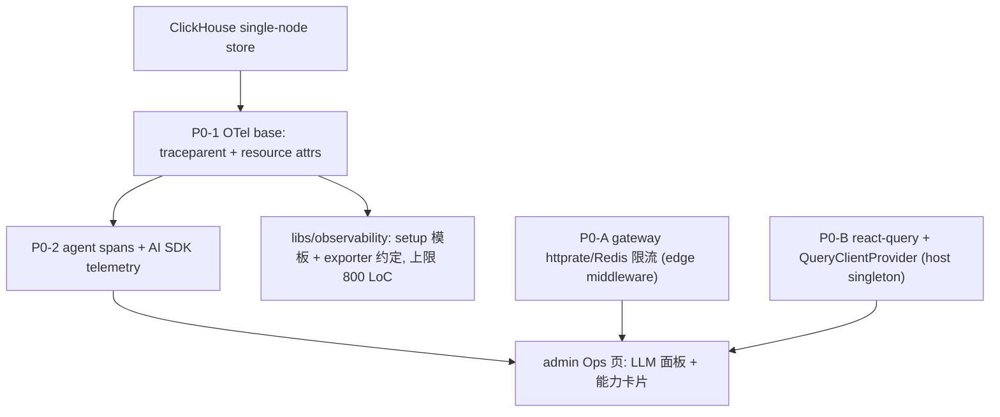

# Go/Python/TS 混合微服务最佳实践差距分析

> 状态：调研 + 落地路线（未写业务代码）。本文由早期"GitHub 热门仓库接入调研"就地升级而来，
> 面向本仓库的混合微服务（Go gateway + Python FastAPI + TS chat/executor）与微前端架构，
> 输出"哪些已正确引入、哪些应深化、哪些真缺、哪些不做"的差距分析，并给出按 P0/P1/P2 排序、
> 带验收信号的候选清单、Admin Ops 总览页信息架构，以及 P0 主线的实施拆分。
>
> 约束来源：`.cursor/skills/plan/SKILL.md` 五条硬约束 + 根 `AGENTS.md`（demo 阶段禁测、单 agent 优先、
> AI-Native、future-first、libs kernel-only、跨栈只经 `schemas/`）。具体 star/版本以官方仓库为准。

## 一、筛选标准

- 无成见：先判断"项目已有的是否够用"，只保留补空白或显著增强的，拒绝重复造轮子。
- 官方优先：AI 决策以 AI SDK v7 官方能力为准（`ToolLoopAgent` / UIMessage / telemetry），耐久任务使用 Workflow DevKit 固定 functions。
- 单 agent 优先：拒绝 role-play 多 agent 编排框架。
- 复制标杆：优先采纳 Claude Code / Codex / Cursor / Vercel AI SDK 已验证的形态。
- 无历史包袱：能对齐官方标准就对齐，不加兼容层。

## 二、现状快照（决定"什么才算空白"）

### 已成熟、无需替换

- Agent 运行时 = AI SDK v7 `ToolLoopAgent`（`apps/backend/services/chat/src/application/agent/agents/tool-loop.ts`，含 `stopWhen`、tool approval、`toolsContext`）
- 持久后台任务 = Workflow DevKit + Nitro（`apps/backend/services/executor/`）
- RAG = pgvector 混合检索（dense + BM25 + RRF + rerank + Contextual Retrieval，`apps/backend/services/knowledge/`）
- 文档转换 = `markitdown[all]>=0.1.3`（`apps/backend/services/knowledge/src/application/convert.py`，图片走 vision LLM caption）
- 流式 UI = streamdown + 自研 `AiChat/`；富文本 = TipTap 3
- 流式契约 = `schemas/streaming/chat-uimessage-stream.md`（reuse-first，官方 `text`/`reasoning`/`tool-*`/`file`/`source-*`/`metadata`）
- 可恢复流 = Redis Streams；web 搜索 = Tavily
- 跨栈契约 = `schemas/openapi/*`（admin/chat/knowledge/telemetry/executor）+ Orval 生成 TS 客户端
- 边缘 trace = gateway 统一 `X-Trace-Id`，前端 `packages/observability` 已在请求注入 trace id

### 明确空白 / 薄弱

- **LLM 工程级可观测**（token/成本/延迟/prompt 版本/在线 eval）——目前只有自研 **PostgreSQL** 业务 trace（`chat.agent_runs` / `agent_steps` / tool call trace），面向"给用户看的 run/step/tool"，缺"给开发者看的 LLM 调优"视角。
- **分布式 trace / metrics**——仅有 `trace_id` 日志字段，无 OpenTelemetry span 导出、无 W3C `traceparent` 全链路传播、无 metrics。
- **Gateway 边缘限流**——`go.mod` 只有 `chi`/`godotenv`/`go-redis`，无限流；且 gateway 是纯 `httputil` 流式反向代理，无 `internal/infrastructure/clients/` 层（其 `AGENTS.md` 关于 "downstream retry via internal/infrastructure/clients" 的描述与代码不符，待订正）。
- **前端服务端状态**——admin CRUD 页（如 `IntentionsPage.tsx`）大量手写 `useEffect/useState` 拉取/刷新/竞态，未引入 `@tanstack/react-query`（全仓当前未引入）。
- **契约覆盖缺口**——`executor-server.json` 已存在但 `packages/api/generated/` 无对应客户端；IAM（Go）无 OpenAPI，session/orgs 全手写；手写 `admin-server.ts`（约 36 个 export）与 generated client 并行，存在漂移。
- **索引可靠性**——knowledge 后台索引是单进程 demo 调度器（advisory-lock 单飞），非 durable 队列。
- **Web 深取**——只有 Tavily"搜"，无"读整页 / 爬站 / 抽结构"。
- **事件流未实体化**——只有 `schemas/events/bot.published.v1.json` 一个 schema，无 broker/publisher/consumer。
- **对象存储**——knowledge 只有本地 FS demo 后端，无 S3/MinIO。

## 三、三方库清单（新增 vs 深化 vs 不做）

### 需新增（本仓库当前未引入）

| 库 | 落点 | 作用 |
|---|---|---|
| `opentelemetry-*`（Go / Python / TS 各自 SDK）+ OTel Collector + ClickHouse | gateway / FastAPI 服务 / chat·executor / single-vps infra | trace + metrics + 统一 resource attributes + 单机 OLAP 观测库 |
| AI SDK `telemetry` + ClickHouse 数据面 + Phoenix / OpenLLMetry / Langfuse / Laminar（评估） | chat（埋点）+ 观测后端 | LLM 级 token/成本/延迟/prompt/tool trace |
| `go-chi/httprate` 或 Redis sliding-window | gateway middleware | 边缘限流，控 API/LLM 成本入口 |
| `@tanstack/react-query` | 前端 `packages/api` + admin | 服务端状态、缓存、失效、竞态 |
| `@tanstack/react-table` | 前端 admin | 能力/服务/run/文档/事件明细表 |
| `recharts` | 前端 admin | token 成本/延迟/转换耗时/命中率趋势图 |
| `@tanstack/react-virtual` 或 `react-virtuoso` | 前端 chat/admin | 长会话、trace timeline、事件流虚拟化 |

### 已引入需深化（不重复引入）

| 库 | 现状 | 深化方向 |
|---|---|---|
| `markitdown[all]` | knowledge convert 已用 | 建质量基准样本；扫描件/图片型 PDF 不达标时再按顺序评估补件（见 P1） |
| AI SDK v7 | chat 已用 | 打开官方 `telemetry`，保持 ToolLoopAgent 为唯一 agent loop |
| Redis Streams | chat SSE 重放已用 | 复用为 CloudEvents 传输候选（P1） |
| Orval codegen | 4 个服务已生成 | 补 `executor-server`、收敛手写 wrapper（P1） |

### P1/条件性新增（有明确价值，需一次性设计或授权）

| 库 | 触发条件 |
|---|---|
| Firecrawl / Jina Reader | 需要 web 深取（读整页/爬站/抽结构）时 |
| Docling / Unstructured / Azure Document Intelligence | `markitdown[all]` 已覆盖多格式与 PDF 文本层；仅当扫描件/图片型 PDF 基准不达标时再按场景补专用后端 |
| `@aws-sdk/client-s3` / Python S3 SDK | 对象存储脱离单 VPS demo 时 |
| Redis Streams / NATS client | 事件流实体化时 |
| `ragas` / promptfoo / DeepEval | RAG/agent 离线评估——**受 demo 阶段禁测规则约束，需用户显式授权** |

### 明确不做（附理由）

- **LangGraph / Mastra / AutoGen / CrewAI 作为主 agent runtime**：违反"单 agent 优先"，已有 ToolLoopAgent + Workflow DevKit，叠第二套编排会上下文分裂、工具协议重复。
- **LangChain / LlamaIndex 整体替换 RAG**：现有 pgvector 混合检索已按 2026 实践落地，替换收益不确定；至多借鉴单点工具。
- **Next.js / Base UI / nuqs**：与 Rspack + Module Federation + React Router 架构冲突（Base UI 与 radix 底座冲突，nuqs 为 Next 专用）。
- **react-markdown 替代 streamdown**：AI-Native 规则已排除。
- **mem0 / Zep 自动记忆**：已有"LLM 提取 + 用户审批"人工确认记忆，理念不同，仅评估级。

## 四、候选清单（P0/P1/P2）

每条含：落点 / 收益 / 风险 / 依赖边界 / 验收信号 / 是否 ADR / 是否 `just sync` / 前端展示。

### P0 —— 一条有依赖顺序的可观测性主线 + 两个独立小候选

原先并列的 5 条粒度不齐，按依赖收敛。P0 只保留"应最先做"的。

#### P0-1 ClickHouse + OpenTelemetry 基座（主线第 1 步）

- 落点：single-vps infra 增加 ClickHouse + OTel Collector；各语言各自的 OTel setup；`libs/observability`（软上限 < 800 LoC）只收敛 setup 模板、resource attribute 约定、exporter 配置。**不是**跨语言共享运行时（`libs/` 是 kernel-only）。
- **一期范围**：组件一步到位，数据策略克制。打通 `gateway → chat → knowledge/executor` 的 `traceparent` 传播 + resource attributes + ClickHouse exporter；默认 trace TTL 7 天，不逐条记录 SSE token chunk，不默认保存完整 prompt/response 正文。
- 收益：一次请求全链路可见；为 P0-2 提供不锁厂商的埋点基座。
- 风险：4C4G40G 内存和磁盘紧；ClickHouse 必须低资源配置（限制 query/merge 并发、system log 表、collector batch 队列），保留 20%-25% 磁盘空闲。
- 依赖边界：从现有 `X-Trace-Id` 边界扩展到 W3C `traceparent`；不改业务逻辑。
- 验收信号：一条跨 `gateway → chat → knowledge/executor` 的请求在 ClickHouse `otel_traces` 中出现连续、同 trace 的多个 span，带统一 resource attributes（service.name / deploy.env）。
- ADR：需要（ADR-0038）。`just sync`：否。
- 前端展示：能力总览卡片"ClickHouse + OTel 基座"状态 + 近一小时 span 数。

#### P0-2 AI/LLM 工程级可观测（主线第 2 步，依赖 P0-1）

- 落点：chat agent model step / tool call 写入 OTel span，后续打开 AI SDK `telemetry`（`ToolLoopAgent` / `streamText`）并对齐 OpenTelemetry GenAI 语义；观测数据先落 ClickHouse，Phoenix/Langfuse/Laminar 作为上层 UI/分析平台评估。
- 收益：token/成本/延迟/模型/prompt/tool 调用链可见；补 prompt 版本管理与在线 eval 入口。**与现有 `agent_runs` 用户侧 trace 互补，不替代。**
- 风险：无 P0-1 的 exporter/attribute/retention 约定会各自埋点、后端锁定；4C4G40G 不默认自托管完整 Langfuse v3 全栈。
- 依赖边界：观测信号，绝不阻断生成（trace 持久化失败不影响出流）。
- 验收信号：一次 run 的 model step / tool call / token usage / 延迟出现在 ClickHouse 或 admin ops 面板，并能通过 trace id 下钻。
- ADR：需要（LLM 可观测选型）。`just sync`：否。
- 前端展示：LLM 运行面板（请求量/token/成本/延迟/模型分布/tool 成功率）。

#### P0-A Gateway 边缘限流（独立）

- 落点：`go-chi/httprate`（内存/单实例）或 Redis sliding window（多副本），作为 chi middleware 挂边缘。
- 收益：控外部请求与 LLM 成本入口，防滥用。
- 风险：**不要把"下游 retry/backoff"塞进 gateway**——它是纯流式反向代理，无 typed client 层，对已消费/流式 body 做请求级重试是反模式。下游重试的正确落点是发起业务调用的服务端（如 chat 的 `transport-ts` 客户端），且仅限幂等、非流式、连接级失败。gateway `AGENTS.md` 相关描述需同步订正为现状。
- 依赖边界：Redis 方案复用现有 Redis；不新增基础设施。
- 验收信号：超阈值返回 429 且带 `Retry-After`；限流命中可在日志/metrics 观测。
- ADR：可选（若引入 Redis 限流策略建议记一笔）。`just sync`：否。
- 前端展示：能力卡片"限流"状态 + 命中趋势/热门路径。

#### P0-B 前端服务端状态（独立）

- 落点：引入 `@tanstack/react-query`，配合 Orval query client 或 generated facade；host 挂 `QueryClientProvider`，MF 下 QueryClient 建议 host singleton（比照 zustand/runtime 的 `mf-shared.mjs` 策略）。
- 收益：消灭 admin CRUD 页重复的 loading/error/refetch/竞态；为 Ops 总览页轮询/缓存打底。
- 风险：MF singleton 未处理会出现多 QueryClient；需在 `mf-shared.mjs` 评估共享层级。
- 依赖边界：走现有 `apiHttp`/`apiMutator`，不新建 axios 实例。
- 验收信号：指定 admin 页面（如 `IntentionsPage.tsx`）移除手写 `useEffect` 拉取，刷新/竞态由 query 接管。
- ADR：可选。`just sync`：否（除非同时补 codegen）。
- 前端展示：本身就是前端提效底座。

### P1 —— 明确价值，需一次性设计

- **API 契约收敛**：补 `executor-server` 的 Orval 覆盖；规划 IAM OpenAPI（当前无 `iam-server.json`）；逐步废弃手写 `admin-server.ts` 收敛到 generated + 极薄 facade。验收：admin 页面 import 来自 generated；`just sync` 后类型自动对齐。ADR：可选。`just sync`：是。
- **Knowledge indexing durable 化**：单进程 demo 调度器迁 `executor` Workflow task type，复用 Workflow DevKit。验收：kill 进程后任务可恢复，多副本不重复/不丢。ADR：需要。`just sync`：视是否新增 task 契约。
- **MarkItDown 深化**：建质量基准样本；`markitdown[all]` 已覆盖多格式与 PDF 文本层，仅当扫描件/图片型 PDF 不达标时再评估 Docling / Unstructured / Azure Document Intelligence 作为可选 backend。不扩散到 chat。验收：基准样本转换质量报告 + backend 选型结论。ADR：视是否新增 backend。
- **Web 深取**：保留 Tavily 做发现，新增 Firecrawl/Jina Reader 做 `scrape_url`/`crawl_site`，输出 Markdown 进 knowledge ingest/RAG（hosted API 无 license 传染；自托管 Firecrawl 受 AGPL-3.0 约束）。验收：一个 URL 抓取入库并被 `knowledge_search` 命中。ADR：可选。
- **CloudEvents 实体化**：选 Redis Streams 或 NATS，优先覆盖 admin 写后缓存失效、审计、跨 MFE 刷新。验收：admin 写后 consumer 收到事件并失效缓存。ADR：需要。
- **对象存储抽象**：knowledge 从本地 FS 扩展到 S3/MinIO 兼容层，内容仍由 knowledge 拥有。验收：切换后端不改上层 ingest/retrieve。ADR：需要。

### P2 —— 体验与规模化增强

- Admin 管理面提效：裁剪式 `@tanstack/react-table` DataTable + React Router `useSearchParams` URL 状态 helper（替代 nuqs）。
- OpenAPI 语义治理：Spectral 或 Redocly lint（operationId、错误 schema、命名一致、breaking 规则），合入 `contracts.yml`。
- 图感知 CI：基于 pnpm/turbo、uv、go work 与依赖图生成 affected matrix，替代静态 path filter。
- 长会话性能：chat UI 评估 `@tanstack/react-virtual`/`react-virtuoso`，保持 streamdown，与 `use-stick-to-bottom` 协调。
- RAG eval：`ragas`/promptfoo/DeepEval——**需用户显式授权突破 demo 禁测规则**，先做离线度量而非 CI 门禁。

## 五、Admin Ops 总览页信息架构

入口放在 `admin` MFE 下（如 `/platform/admin/ops` 或 `/platform/admin/capabilities`）。admin 本就是配置/运营平面，适合"能力已接入 / 运行是否健康 / 收益是否明显"。不新建独立 MFE，除非后续复杂到需独立部署。

### 页面结构

- **能力总览**：卡片展示 AI telemetry / OTel / 限流 / 文档转换 / Web 深取 / Workflow 索引 / CloudEvents / 对象存储 / 契约治理的启用状态、负责服务、最近健康。
- **LLM 运行面板**：请求量、token、成本、P50/P95 延迟、模型分布、tool 成功率、失败原因；明细深链到单次 `agent_run` 或外部 Phoenix/Langfuse trace。
- **RAG 与文档面板**：上传数、转换成功率/耗时、backend 命中（MarkItDown / 可选 Docling）、chunk 数、检索命中率、rerank 耗时、索引队列状态。
- **Workflow 与任务面板**：executor task 的 running/failed/completed 分布、取消率、平均耗时、卡住任务；knowledge indexing 迁移后并入。
- **契约健康面板**：OpenAPI/Proto/Event/Streaming 覆盖，哪些服务已 codegen、哪些仍手写 wrapper，最近一次 `just sync` / CI contract check 结果。
- **事件与缓存面板**：CloudEvents 事件流、Redis/NATS lag、admin 写后缓存失效命中、消费者状态。

### 数据来源与契约边界（硬约束）

- 现有数据：`chat.agent_runs` / `agent_steps` / tool call trace、knowledge documents/index status、executor tasks、telemetry RUM。
- **聚合方式必须守边界**：各服务提供**只读观测 DTO** `/internal/ops/*`，由 `admin` 拉取 sibling internal API 后聚合。**禁止前端直连内部服务；禁止 admin 跨服务直接查别人的 DB。** ops DTO 是观测投影，不是业务表复制，走 typed client（`transport-ts`）/ 纳入 OpenAPI codegen，不手写漂移。
- 外部可观测平台：Phoenix/Langfuse/Laminar 只做深链或嵌入摘要，不作为业务唯一真相。
- 契约状态：从 `schemas/` 与 codegen 配置生成构建期摘要，必要时由 `admin` 暴露只读接口。

### UI 形态

- 首页：KPI cards + 小趋势图（recharts），一眼看"接上没 / 有收益没 / 哪报警"。
- 二级页：DataTable（react-table），服务/run/文档/事件可筛选、排序、复制 trace id。
- Timeline：单次 agent run 串起用户消息 → 模型 step → tool call → executor task → knowledge 检索 → 输出（长列表虚拟化）。
- 文档转换对比视图：同一文件展示 MarkItDown 输出 vs 可选 Docling/Unstructured 输出 vs RAG chunk 预览，用于决定是否真的引重依赖。

## 六、P0 主线实施拆分（不改业务代码，先约定与验证）

1. P0-1 先写 ADR 定基座约定（ClickHouse、resource attributes、exporter、TTL、`traceparent` 传播规则），再验证一条连续 trace。
2. P0-2 依赖 P0-1，先把 agent model step / tool call / token usage 落到 span，再评估 AI SDK telemetry 与上层观测 UI。
3. P0-A / P0-B 与主线并行，边界互不耦合。
4. Admin Ops 页作为四者的统一呈现层，最后接线。

## 七、infra 影响与是否新增 server（大白话小结）

- **不新增业务 server**：Ops 页走现有 `admin` MFE，后端数据由各服务只读 `/internal/ops/*` + admin 聚合。
- **会加观测基础设施**：ClickHouse + OTel Collector 一步到位；Phoenix/OpenLLMetry/Langfuse/Laminar 作为上层 UI/分析平台评估，不在 4C4G40G 上默认全量自托管。
- **限流**：Redis 方案复用现有 Redis；内存方案几乎不动 infra。
- **P1 才可能新增**：S3/MinIO、NATS、Firecrawl 自托管——非 P0 必需。
- **迁移安全**：任何结构变更须保持 `just install/up/dev/build/sync/lint` 可用（根 `AGENTS.md`）。

## 八、参考来源（2026）

- 可观测性：[Laminar "Top 6 Agent Observability 2026"](https://laminar.sh/article/2026-04-23-top-6-agent-observability-platforms)、[langfuse/langfuse](https://github.com/langfuse/langfuse)、OpenTelemetry GenAI 语义规范
- AI SDK：ai-sdk.dev（`ToolLoopAgent` / `createAgentUIStreamResponse` / telemetry）、bundled `node_modules/ai/docs/**`
- 文档摄取：[microsoft/markitdown](https://github.com/microsoft/markitdown)、[Docling vs MarkItDown](https://www.file2markdown.ai/blog/docling-vs-markitdown)、OpenDataLoader PDF-to-Markdown 基准
- Web 抓取：[Firecrawl vs Tavily vs Exa 2026](https://pondero.ai/agents/guides/firecrawl-vs-tavily-vs-exa-web-search-api-agents-june-2026/)
- Polyglot monorepo / 契约：[Buf](https://buf.build)、[API Schema Landscape 2026](https://www.youngju.dev/blog/culture/2026-05-14-api-schema-2026-json-schema-openapi-3-1-asyncapi-graphql-grpc-deep-dive.en)、[Monorepo CI/CD 2026 patterns](https://www.ugurkaval.com/blog/monorepo-cicd-github-actions-patterns-2026)
- Eval：[confident-ai/deepeval](https://github.com/confident-ai/deepeval)、ragas、promptfoo
- 前端：[vercel/ai-elements](https://github.com/vercel/ai-elements)、`@tanstack/react-query`·`react-table`·`react-virtual`、recharts
