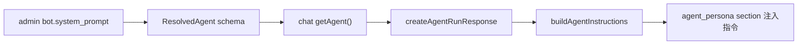
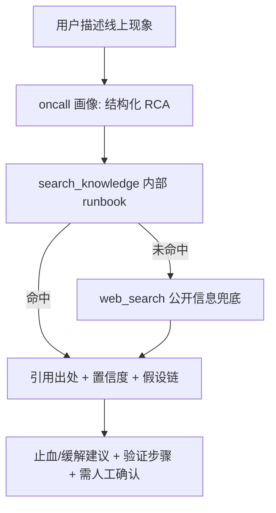

# Oncall Agent 落地方案

> 状态：方案阶段（未写代码，暂不执行）。本文件是聚焦 oncall agent 的完整实施计划，
> 明确不改动工具体系。动工前需先确认文末「决策点」；落地后按需将精简决策固化为
> `docs/ADR/`。

## 概述

复用现有知识库 RAG 与 admin bot 配置，把企业 oncall 文档迁入知识库，配置一个带
"结构化 RCA 画像"的 oncall bot，在 chat 内做检索增强定位。本次不新增/改造工具，
oncall 能力靠"画像 + 现有 `search_knowledge` / `web_search` / `todo`"实现。

## 结论：可以落地，基础设施已就绪，缺口只在"画像"和"知识治理"

三层能力盘点：

- RAG 层（生产级，无需改）：混合检索 dense+sparse + RRF + cross-encoder rerank
  (`apps/backend/services/knowledge/src/knowledge/services/retrieval.py`) + Anthropic
  Contextual Retrieval (`apps/backend/services/knowledge/src/knowledge/services/contextual.py`)
  + CJK-aware 分块 (`apps/backend/services/knowledge/src/knowledge/services/chunking.py`)。
  `search_knowledge` (`apps/backend/services/chat/src/agent/tools/builtins/knowledge-search.ts`)
  返回 chunk 数组而非灌全文，是真 RAG。
- 知识管理层（现成）：admin 已有知识库管理页
  `apps/frontend/apps/admin/src/pages/KnowledgeBasePage.tsx`——上传任意格式自动转 md +
  建索引 + 列表/在线编辑/批量删除。
- 消费层（现成）：chat `ToolLoopAgent` + `search_knowledge` + `web_search`
  (`apps/backend/services/chat/src/agent/tools/builtins/web.ts`) + `todo`/`plan`，
  足够支撑结构化排查。

真正缺的两块：(1) oncall 专属画像（结构化 RCA 指令）；(2) 知识治理（新鲜度、团队共享）。
两者都不需要动工具。

## 核心设计决策：oncall = admin 里配置的一个 bot（带画像）

不在 chat 硬编码新 mode，理由：

- 契合仓库架构（`AGENTS.md`：admin 是配置中心，owns bots）；bot 概念已存在
  (`apps/backend/services/admin/src/admin/models/bot.py`)，`agent_id` 消费链路已存在
  (`apps/backend/services/chat/src/routes/agents.ts` 第 46 行)。
- `AgentMode` 只有 `normal|plan` 且 mode 存在 conversation 上
  (`apps/backend/services/chat/src/agent/runs/run.ts` 第 227 行)，走 mode 要改传递链路
  且不可由运营配置。
- 现状缺口：bot / `ResolvedAgent`
  (`apps/backend/services/admin/src/admin/schemas/bot.py`) 只有 name+provider，无画像；
  `getAgent` (`apps/backend/services/chat/src/clients/admin.ts` 第 89 行) 只取 provider；
  `buildAgentInstructions`
  (`apps/backend/services/chat/src/agent/context/instructions.ts` 第 76 行) 不接收 agent 画像。

画像注入链路（Phase 1 要打通的）：

oncall 消费流（画像驱动，复用现有工具）：

## Phase 0 — 零改动验证（先做，判断价值）

- 用 admin 知识库管理页上传 3-5 篇代表性 oncall 文档（现有导出即可）。
- chat 内直接问典型排查问题，观察 `search_knowledge` 命中与定位质量。
- 产出 go/no-go，以及画像重点与元数据需求清单。此阶段无代码改动。

## Phase 1 — oncall bot 画像（核心 MVP，可跑）

后端 admin（一次 CRUD + gRPC/HTTP 贯通）：

- `apps/backend/services/admin/src/admin/models/bot.py` 的 `BotRow` 加
  `system_prompt: Text|null` + 新建 migration（`migrations/versions/`，禁止改历史版本）。
- `apps/backend/services/admin/src/admin/schemas/bot.py`：`Bot` / `UpdateBotInput` /
  `ResolvedAgent` 加 `system_prompt`。
- crud/services（`crud/`、`services/bots.py`）落库；`just gen-openapi admin` + `just sync`
  回流前端类型。

chat 注入链路：

- `apps/backend/services/chat/src/clients/admin.ts` 的 `getAgent` /
  `ResolvedAgentProviders` 带 `persona`。
- `apps/backend/services/chat/src/routes/agents.ts`：`agent` 已解析，将 `persona` 经
  `RunAgentInput` 传入 `createAgentRunResponse`。
- `apps/backend/services/chat/src/agent/runs/run.ts` 的 `createAgentRunResponse` 透传给
  `buildAgentInstructions`。
- `apps/backend/services/chat/src/agent/context/instructions.ts` 的
  `buildAgentInstructions` 增加可选 `agentPersona`，作为 `<agent_persona>` section 注入
  （在 `BASE_INSTRUCTIONS` 之后、mode 指令之后）。

oncall 画像内容（写进 `bot.system_prompt`）：

- 结构化 RCA 流程：确认现象 -> 界定影响面/爆炸半径 -> 分诊假设 -> 给止血/缓解 -> 验证
  -> 复盘建议。
- 证据纪律：每个结论引用知识库出处 + 标注置信度 + 显式列假设；未命中知识库时不臆造。
- 检索路由：内部 runbook 优先（`search_knowledge`），公开信息兜底（`web_search`），
  冲突以内部 runbook 为准（回应"联网检索"诉求——它是补充而非主力）。
- 只读安全：不代执行高危变更，只产出建议并要求人工确认。

前端 admin：

- bot 配置对话框加"系统画像/指令"多行编辑
  (`apps/frontend/apps/admin/src/components/AgentModelDialog.tsx` 附近)。

chat 消费入口：

- 发起 run 时带 oncall bot 的 `agent_id`
  (`apps/backend/services/chat/src/routes/agents.ts` 的 `runSchema.agent_id` 已支持)；
  确认/补齐前端「选择 bot」入口。

## Phase 2 — 知识治理与团队共享（决策点，MVP 后）

- 文档新鲜度元数据：`apps/backend/services/knowledge/src/knowledge/models/document.py` 的
  documents 表加 `source_url` / `last_reviewed_at` / `version` / `authority` + migration；
  检索结果透出这些字段；画像对过时 runbook 降权并提示。
- 批量迁移：新增内部导入接口/脚本，基于 `create_document(content_md)` + `index_document`，
  从 Confluence/飞书导出批量灌入（当前只能单文件 UI 上传）。
- 团队共享 ACL：当前知识 user-scoped
  (`apps/backend/services/knowledge/src/knowledge/services/retrieval.py` 按 `user_id`)。
  团队共享需给 document 加 `visibility(private|org)` + retrieve 支持 org 级，或 bot 绑定
  共享知识集。见决策点 2。

## Phase 3 — 可观测性联动（可选后续）

- 经 MCP 动态注入
  (`apps/backend/services/chat/src/agent/integrations/mcp/provider.ts`) 接
  metrics/logs/tracing 的只读工具，让 agent 从"读经验"升级到"读现场"；保持单 agent、
  只读、人在环。

## 不做（本次范围）

- 不改工具体系（不拆 file 工具、不加 read_knowledge_document）。oncall MVP 靠画像 +
  现有 `search_knowledge` / `web_search` / `todo` 即可。

## 实施清单

- [ ] Phase 0：admin 知识库页上传代表性 oncall 文档，chat 内验证检索命中与定位质量（零改动 go/no-go）
- [ ] Phase 1：admin `BotRow` 加 `system_prompt` + migration；schemas 三处加字段；crud/services 落库；`gen-openapi` + `just sync`
- [ ] Phase 1：chat 注入链路 `getAgent` -> `agents.ts` -> `createAgentRunResponse` -> `buildAgentInstructions` 的 `<agent_persona>` section
- [ ] Phase 1：编写 oncall 结构化 RCA 画像文案，写入 `bot.system_prompt`
- [ ] Phase 1：admin 前端 bot 配置加系统画像编辑；确认/补齐 chat 端选择 oncall bot 入口
- [ ] Phase 2：documents 新鲜度元数据字段 + migration + 检索透出 + 画像降权
- [ ] Phase 2：批量导入接口/脚本（`create_document` + `index_document`）
- [ ] Phase 2（决策）：知识库团队共享可见范围（visibility/org 或 bot 绑定共享集）
- [ ] Phase 3（可选）：MCP 接 metrics/logs/tracing 只读工具

## 决策点（默认已选，确认时可调）

1. 画像落点：admin bot `system_prompt` 字段（默认，推荐）/ chat 硬编码 oncall mode（不推荐）。
2. 团队共享：MVP 先用单一"oncall 运营账号"维护知识 + bot，暂不改 ACL（默认）/ 立即做
   org 级可见（需改 retrieval scope）。
3. 新鲜度元数据：放 Phase 2（默认）/ 提前到 Phase 1 同做。
4. 交付范围：本次做到 Phase 1 可跑 MVP（默认）/ 含 Phase 2 治理。
