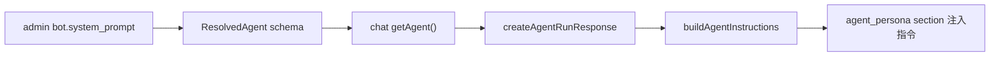
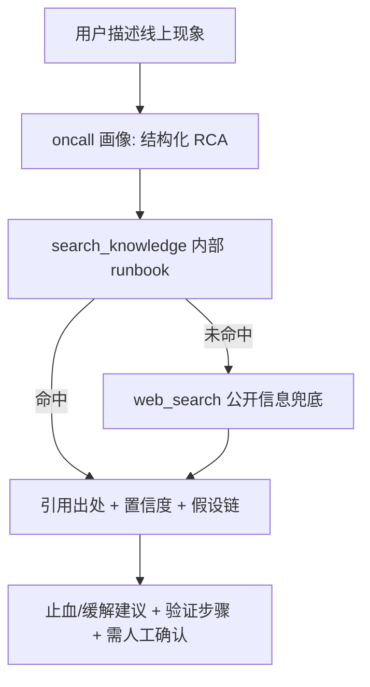

# Oncall Agent 落地方案

> 状态：**已落地并演进**。Phase 1 画像链路 + org 团队知识共享见
> `docs/ADR/0026-oncall-agent-org-knowledge-sharing.md`。
>
> **架构演进（ADR-0033）**：面向 to-B 前场支持场景，能力沉淀为 Admin 管理并绑定到 Bot 的
> `oncall-rca` Skill。Chat 初始上下文只暴露名称与描述，命中场景后由通用
> `load_skill` 按需载入完整工作流；主 `ToolLoopAgent` 继续使用 `ask_user`、
> `knowledge_search`、`web_search` 和 `write_file` 等通用工具，不增加专用 oncall tool、
> 嵌套 agent 或手写模型 pipeline。持久决策见
> `docs/ADR/0033-admin-managed-skills-end-to-end.md`。

## 落地状态（as-built）

相较原方案，**按用户诉求把「团队知识共享」从 Phase 2 决策点提前并入本次交付**，因此除了
Phase 1 的 oncall 画像链路，还额外落地了一层 org 多租户基座：

- **IAM 多租户基座**：新增 `organizations` + `organization_members` 表（`iam/internal/model/models.go`
  + migration `v1.1.0.sql`），JWT `Claims` 带 `org_id`，登录/刷新解析用户主 org，`/me` 与
  `AuthResponse.user` 回传 `orgId`/`orgName`；注册用户自动加入 demo 团队 org。
- **Gateway 透传**：`propagateClaims` 注入 `X-Auth-Org-ID`，并剥离入站伪造头。
- **知识库 org 化**：`documents` / `document_chunks` 加 `org_id`（migration `v1.5.0.sql` + 复合索引 +
  回填 `guest-org`）；检索 `dense_search` / `sparse_search` 与写入/ingest/ACL 全部改按 `org_id`，
  同一团队成员共享同一知识库。`RetrieveInput` + `/internal/retrieve` 携带 `org_id`。
- **admin bot org 化 + 画像**：`bots` 加 `org_id` + `system_prompt`（migration `v1.7.0.sql`，
  `org_id` 在 `v1.8.0.sql` 收紧为 `NOT NULL`）；`create` 盖章 org，`list`/`get` 按 org 成员可见；
  `get_resolved` 直接按 **bot 自身 org** 解析 provider（团队成员使用 oncall bot 时命中的是团队共享
  provider）。早期草案借 bot owner 用户凭证解析,provider 团队化后该 hack 已移除。
- **全资源表 org 隔离 + providers 团队共享**（按用户诉求"所有资源管理类 tables 都加 org_id 做隔离"）：
  `scenes` / `intentions` / `model_providers` 加 `org_id`（admin migration `v1.8.0.sql`，
  逐列 nullable → 回填 `guest-org` → `NOT NULL`）；对应 crud/services 非管理员按 `org_id` 过滤、
  create 盖章调用方 org。`apps` 保持**全局**（平台配置，非团队资产），chat
  `conversations`/`messages`/`memories` 保持**用户私有**运行时数据,二者都不属"共享资源"故不加
  `org_id`。provider 团队化意味着 **LLM 凭证在团队内共享**;内部解析采用混合信任模型:按 id 查
  (`/internal/providers/{id}`) **不带 org**(不透明 ULID + `X-Internal-Token` 即边界,executor/chat/
  knowledge 等持有具体 `provider_id` 的可信调用方无需层层透传 org);只有 default / by-kind 两个
  "在 org 内检索"的端点携带 `org_id`。
- **chat 画像链路**：`getAgent`/`ResolvedAgent` 带 `system_prompt` → `routes/agents.ts` 经
  `RunAgentInput.persona` → `createAgentRunResponse` → `buildAgentInstructions` 注入
  `<agent_persona>` section（在 BASE + mode 指令之后，安全/工具规则不被覆盖）。
- **oncall RCA 画像**：作为 demo 种子 bot `bot-oncall`（`admin/db.py`，published，归属 `guest-org`）
  写入四段式画像（根因 / 排查 / 验证 / 修复建议 + 出处 + 置信度 + 只读边界）。
- **前端**：platform 顶栏 + 用户菜单展示活跃团队（`AuthUser`/`PlatformUser` 加 `orgId`/`orgName`）；
  admin bot 配置对话框加「人设 / 系统提示词」多行编辑；chat 复用既有智能体选择器即可选中 oncall bot。

未做（明确留后）：完整 org 管理 UI（建组/邀请成员，后端暂无 org CRUD 端点，MVP 单活跃 org）；
批量导入接口（Phase 2）；MCP 现场只读工具（Phase 3，作为 Skill 可调用的只读数据源，
按 org/环境可配）；文档治理元数据（只有出现明确的运营、过滤或排序需求时再做完整竖切）。

已落地（ADR-0033）：Admin 管理的 `oncall-rca` Skill + 渐进披露 `load_skill`；
Knowledge 继续聚焦 chunking、embedding、BM25、RRF、rerank、org ACL 与可验证 chunk 引用。

## 概述

复用现有知识库 RAG 与 admin bot 配置，把企业 oncall 文档迁入知识库，配置一个带
"结构化 RCA 画像"的 oncall bot，在 chat 内做检索增强定位。本次不新增/改造工具，
oncall 能力靠"画像 + 现有 `search_knowledge` / `web_search` / `todo`"实现。

## 结论：可以落地，基础设施已就绪，缺口只在"画像"和"知识治理"

三层能力盘点：

- RAG 层（生产级，无需改）：混合检索 dense+sparse + RRF + cross-encoder rerank
  (`apps/backend/services/knowledge/src/services/retrieval.py`) + Anthropic
  Contextual Retrieval (`apps/backend/services/knowledge/src/services/contextual.py`)
  + CJK-aware 分块 (`apps/backend/services/knowledge/src/services/chunking.py`)。
  `search_knowledge` (`apps/backend/services/chat/src/agent/tools/builtins/knowledge-search.ts`)
  返回 chunk 数组而非灌全文，是真 RAG。
- 知识管理层（现成）：admin 已有知识库管理页
  `apps/frontend/apps/admin/src/pages/KnowledgeBasePage.tsx`——上传任意格式自动转 md +
  建索引 + 列表/在线编辑/批量删除。
- 消费层（现成）：chat `ToolLoopAgent` + `search_knowledge` + `web_search`
  (`apps/backend/services/chat/src/agent/tools/builtins/web.ts`) + `todo`/`plan`，
  足够支撑结构化排查。

真正缺的两块：(1) oncall 专属画像（结构化 RCA 指令）；(2) 知识治理（新鲜度、团队共享）。
两者都不需要动工具。

## 核心设计决策：oncall = admin 里配置的一个 bot（带画像）

不在 chat 硬编码新 mode，理由：

- 契合仓库架构（`AGENTS.md`：admin 是配置中心，owns bots）；bot 概念已存在
  (`apps/backend/services/admin/src/models/bot.py`)，`agent_id` 消费链路已存在
  (`apps/backend/services/chat/src/routes/agents.ts` 第 46 行)。
- `AgentMode` 只有 `normal|plan` 且 mode 存在 conversation 上
  (`apps/backend/services/chat/src/agent/runs/run.ts` 第 227 行)，走 mode 要改传递链路
  且不可由运营配置。
- 现状缺口：bot / `ResolvedAgent`
  (`apps/backend/services/admin/src/schemas/bot.py`) 只有 name+provider，无画像；
  `getAgent` (`apps/backend/services/chat/src/clients/admin.ts` 第 89 行) 只取 provider；
  `buildAgentInstructions`
  (`apps/backend/services/chat/src/agent/context/instructions.ts` 第 76 行) 不接收 agent 画像。

画像注入链路（Phase 1 要打通的）：

oncall 消费流（画像驱动，复用现有工具）：

## Phase 0 — 零改动验证（先做，判断价值）

- 用 admin 知识库管理页上传 3-5 篇代表性 oncall 文档（现有导出即可）。
- chat 内直接问典型排查问题，观察 `search_knowledge` 命中与定位质量。
- 产出 go/no-go，以及画像重点与元数据需求清单。此阶段无代码改动。

## Phase 1 — oncall bot 画像（核心 MVP，可跑）

后端 admin（一次 CRUD + gRPC/HTTP 贯通）：

- `apps/backend/services/admin/src/models/bot.py` 的 `BotRow` 加
  `system_prompt: Text|null` + 新建 migration（`migrations/versions/`，禁止改历史版本）。
- `apps/backend/services/admin/src/schemas/bot.py`：`Bot` / `UpdateBotInput` /
  `ResolvedAgent` 加 `system_prompt`。
- crud/services（`crud/`、`services/bots.py`）落库；`just gen-openapi admin` + `just sync`
  回流前端类型。

chat 注入链路：

- `apps/backend/services/chat/src/clients/admin.ts` 的 `getAgent` /
  `ResolvedAgentProviders` 带 `persona`。
- `apps/backend/services/chat/src/routes/agents.ts`：`agent` 已解析，将 `persona` 经
  `RunAgentInput` 传入 `createAgentRunResponse`。
- `apps/backend/services/chat/src/agent/runs/run.ts` 的 `createAgentRunResponse` 透传给
  `buildAgentInstructions`。
- `apps/backend/services/chat/src/agent/context/instructions.ts` 的
  `buildAgentInstructions` 增加可选 `agentPersona`，作为 `<agent_persona>` section 注入
  （在 `BASE_INSTRUCTIONS` 之后、mode 指令之后）。

oncall 画像内容（写进 `bot.system_prompt`）：

- 结构化 RCA 流程：确认现象 -> 界定影响面/爆炸半径 -> 分诊假设 -> 给止血/缓解 -> 验证
  -> 复盘建议。
- 证据纪律：每个结论引用知识库出处 + 标注置信度 + 显式列假设；未命中知识库时不臆造。
- 检索路由：内部 runbook 优先（`search_knowledge`），公开信息兜底（`web_search`），
  冲突以内部 runbook 为准（回应"联网检索"诉求——它是补充而非主力）。
- 只读安全：不代执行高危变更，只产出建议并要求人工确认。

前端 admin：

- bot 配置对话框加"系统画像/指令"多行编辑
  (`apps/frontend/apps/admin/src/components/AgentModelDialog.tsx` 附近)。

chat 消费入口：

- 发起 run 时带 oncall bot 的 `agent_id`
  (`apps/backend/services/chat/src/routes/agents.ts` 的 `runSchema.agent_id` 已支持)；
  确认/补齐前端「选择 bot」入口。

## Phase 2 — 检索质量与团队共享（决策点，MVP 后）

- 优先持续改进文档解析、chunking、embedding、BM25、RRF 与 rerank。新鲜度、版本或
  authority 元数据只在出现明确的运营维护流程和检索策略后再设计，不预埋自由文本字段。
- 批量迁移：新增内部导入接口/脚本，基于 `create_document(content_md)` + `index_document`，
  从 Confluence/飞书导出批量灌入（当前只能单文件 UI 上传）。
- 团队共享 ACL：当前知识 user-scoped
  (`apps/backend/services/knowledge/src/services/retrieval.py` 按 `user_id`)。
  团队共享需给 document 加 `visibility(private|org)` + retrieve 支持 org 级，或 bot 绑定
  共享知识集。见决策点 2。

## Phase 3 — 可观测性联动（可选后续）

- 经 MCP 动态注入
  (`apps/backend/services/chat/src/agent/integrations/mcp/provider.ts`) 接
  metrics/logs/tracing 的只读工具，让 agent 从"读经验"升级到"读现场"；保持单 agent、
  只读、人在环。

## 不做（本次范围）

- 不改工具体系（不拆 file 工具、不加 read_knowledge_document）。oncall MVP 靠画像 +
  现有 `search_knowledge` / `web_search` / `todo` 即可。

## 实施清单

- [x] Phase 1：admin `BotRow` 加 `system_prompt`（及 `org_id`）+ migration `v1.7.0.sql`；schemas 三处加字段；crud/services 落库；`gen-openapi` + `just sync`
- [x] Phase 1：chat 注入链路 `getAgent` -> `agents.ts` -> `createAgentRunResponse` -> `buildAgentInstructions` 的 `<agent_persona>` section
- [x] Phase 1：编写 oncall 结构化 RCA 画像文案，作为种子 bot `bot-oncall` 写入 `bot.system_prompt`
- [x] Phase 1：admin 前端 bot 配置加「人设/系统提示词」编辑；chat 端复用既有智能体选择器选中 oncall bot
- [x] 团队共享（原 Phase 2 决策 2，提前落地）：org 多租户基座（IAM organizations + JWT + gateway header）+ 知识库 `org_id` 检索/ACL + admin bot org 化
- [x] 全资源表 org 隔离（用户追加诉求，破坏性迁移已获准）：`scenes`/`intentions`/`model_providers` 加 `org_id` + migration `v1.8.0.sql`（回填 `guest-org` → `NOT NULL`）+ `bots.org_id` 收紧 `NOT NULL`；provider 团队共享 + 内部 by-id 解析不带 org（Option Y）；`gen-openapi` + `just sync` 回流
- [x] 前场支持能力演进（ADR-0033）：Bot 绑定 Admin 管理的 `oncall-rca` Skill；L1 名称/描述常驻，`load_skill` 按需加载 L2 正文；主 agent 复用 `ask_user` / `knowledge_search` / `web_search` / `write_file`
- [ ] Phase 2 知识治理元数据：仅在出现明确的运营流程与检索策略后再做，不预埋 `knowledge_version` 等无人消费字段
- [ ] Phase 2：批量导入接口/脚本（`create_document` + `index_document`）
- [ ] 完整 org 管理 UI（建组/邀请成员）+ IAM org CRUD 端点（当前仅 demo 单 org 种子）
- [ ] Phase 3（可选）：MCP 接 metrics/logs/tracing 只读工具

## 决策点（已定稿）

1. 画像落点：**admin bot `system_prompt` 字段**（已采用）。未在 chat 硬编码 oncall mode。
2. 团队共享：**立即做 org 级可见**（已采用，超出原 MVP 默认）——按用户诉求引入 workspace/团队
   概念，知识与 bot 按 `org_id` 团队内共享。为与后续桌面端 app 的 workspace 解耦，多租户实体
   命名为 **organization**（团队），而非泛化的 workspace。**范围扩展**：按用户"所有资源管理类
   tables 都加 org_id"的追加诉求，`scenes`/`intentions`/`model_providers` 一并 org 化，且
   `model_providers` 定为**团队共享**（LLM 凭证团队内共用），内部 by-id 解析不带 org（Option Y，
   见 ADR-0026 决策 8）。`apps`（全局平台配置）与 chat 会话/消息/记忆（用户私有运行时数据）不纳入。
3. 新鲜度/版本元数据：**继续留后**；当前先把 embedding、混合检索和 rerank 做好。
4. 交付范围：Phase 1 可跑 MVP + org 团队共享基座（已交付）；系统内置前场支持 Skill
   （ADR-0028，已交付）；批量导入、完整 org 管理 UI、Phase 3 MCP 现场只读工具后续。
5. 前场支持形态：**Skill 渐进披露**。名称/描述帮助主 agent 发现能力，完整模板与约束只在
   命中后载入；不存在专用 tool、第二个模型 pipeline 或 persona 多 agent。
